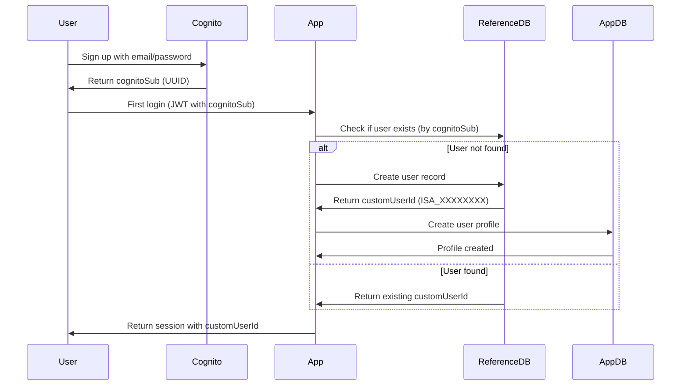

# Reference Database Pattern

## Overview

SportHub uses a **reference database separation pattern** to manage user identity data. This architectural pattern separates user identity (name, email, phone, country) from application-specific data (points, rankings, contest participations).

## Architecture

### Two-Database Design

```
┌─────────────────────────────────────────┐
│     isa-users (Reference Database)      │
│          Region: eu-central-1           │
├─────────────────────────────────────────┤
│  User Identity Data:                    │
│  - Name, Surname                        │
│  - Email, Phone                         │
│  - Country, City, Birth Date            │
│  - Cognito Integration                  │
└─────────────────────────────────────────┘
                    ↑
                    │ isaUsersId link
                    │
┌─────────────────────────────────────────┐
│      users (Application Database)       │
│          Region: us-east-2              │
├─────────────────────────────────────────┤
│  Application Data:                      │
│  - User Profile (role, points)          │
│  - Rankings                             │
│  - Contest Participations               │
│  - RBAC Permissions                     │
└─────────────────────────────────────────┘
```

### Key Concepts

1. **Identity fields cached in sporthub-users**: `name`, `surname`, `country`, and other display fields are stored directly on the sporthub-users Profile record and updated on profile save — hot display paths do not query the reference DB
2. **Reference by ID**: App database references users via `isaUsersId` field
3. **Cross-Region**: Identity DB is in eu-central-1; app DB is in us-east-2 — cross-region queries are avoided except where strictly necessary
4. **Separation of Concerns**: Identity management separate from app logic

### When is the Reference DB Used?

The reference DB is now contacted only on paths that genuinely require it:

| Path | Reason |
|------|--------|
| `onboarding.ts` (JWT callback) | Create record on first login; fetch `customUserId` |
| Migration scripts | Map athletes to ISA IDs |
| `dashboard/actions.ts` `updateProfile()` | Sync edited identity fields back (non-fatal, wrapped in try/catch) |

All other paths — rankings, athlete profiles, event participants, dashboard display — read identity fields directly from the sporthub-users Profile record.

## Benefits

### 1. Eliminates Data Duplication

**Before** (Without Reference DB):
```typescript
// User identity duplicated in multiple tables
{
  userId: "SportHubID:12345",
  name: "John Doe",           // ❌ Duplicated
  email: "john@example.com",  // ❌ Duplicated
  country: "USA",             // ❌ Duplicated
  totalPoints: 1250,
  // ... app data
}
```

**After** (With Reference DB):
```typescript
// isa-users table (identity)
{
  PK: "user:ISA_FBE8B254",
  name: "John Doe",
  email: "john@example.com",
  country: "USA"
}

// users table (app data)
{
  userId: "SportHubID:12345",
  isaUsersId: "ISA_FBE8B254",  // ✅ Reference only
  totalPoints: 1250,
  // ... app data
}
```

### 2. Single Update Point

**When user changes email**:
- Update **one record** in `isa-users`
- All apps referencing that user automatically see new email
- No need to update multiple tables

### 3. Cross-Region User Management

- Identity DB in Europe (GDPR compliance)
- App DBs in any region
- Consistent user data across all applications

### 4. Clean Separation of Concerns

- **Identity Team**: Manages `isa-users` table
- **App Teams**: Manage their own tables, reference users by ID
- Clear boundaries, easier maintenance

## Reference Database Schema

### Table: isa-users

**Region**: eu-central-1
**Primary Key**:
- Partition Key: `PK` - Format: `user:{customUserId}`
- Sort Key: `SK_GSI` - Value: `"userDetails"`

**GSI (Email Lookup)**:
- Partition Key: `SK_GSI` - Value: `"userDetails"`
- Sort Key: `GSI_SK` - Format: `email:{emailAddress}`

### Record Structure

```typescript
{
  // Keys
  PK: "user:ISA_FBE8B254",
  SK_GSI: "userDetails",
  GSI_SK: "email:john.doe@example.com",

  // Cognito Integration
  cognitoSub: "uuid-from-cognito",      // AWS Cognito UUID
  cognitoUsername: "uuid-from-cognito", // Usually same as cognitoSub

  // Identity Data
  name: "John",
  surname: "Doe",
  email: "john.doe@example.com",
  phoneNumber: "+1234567890",
  gender: "male",
  country: "USA",
  city: "Los Angeles",
  birthDate: "1995-03-15",              // ISO date

  // Metadata
  createdDateTime: "2024-01-10T10:30:00Z"  // ISO timestamp
}
```

### Custom User ID Format

- Format: `ISA_XXXXXXXX` (e.g., `ISA_FBE8B254`)
- 8 random hexadecimal characters (uppercase)
- Prefix: `ISA_` (International Slackline Association)
- Example: `ISA_FBE8B254`, `ISA_ABC12345`

## User Onboarding Flow

### New User Registration



### Implementation

**1. JWT Callback** (`src/lib/auth.ts`):
```typescript
async jwt({ token, user }) {
  if (user && token.sub) {
    // Check if user exists in reference DB
    let identity = await getReferenceUserByCognitoSub(token.sub);

    if (!identity) {
      // New user - create in reference DB
      identity = await createReferenceUser(
        token.sub,                    // cognitoSub
        user.email || 'unknown',
        user.name || 'Unknown User'
      );

      // Create app profile
      await createUserProfile({
        userId: `SportHubID:${generateId()}`,
        isaUsersId: identity.userId,  // Link to reference DB
        role: 'athlete',
        // ... other fields
      });
    }

    // Add custom user ID to token
    token.customUserId = identity.userId;
  }

  return token;
}
```

**2. Session Callback**:
```typescript
async session({ session, token }) {
  if (token.customUserId) {
    session.user.customUserId = token.customUserId;
    session.user.id = token.customUserId;  // Use custom ID instead of cognitoSub
  }
  return session;
}
```

## Service Layer

### reference-db-service.ts

**Purpose**: Centralized access to reference database

**Key Functions**:

1. **Get User by Custom ID**:
```typescript
const identity = await getReferenceUserById('ISA_FBE8B254');
// Returns: { userId, cognitoSub, name, email, country, ... }
```

2. **Get User by Cognito Sub**:
```typescript
const identity = await getReferenceUserByCognitoSub('cognito-uuid-123');
// Used during authentication
```

3. **Get User by Email**:
```typescript
const identity = await getReferenceUserByEmail('john@example.com');
// Used for user lookup
```

4. **Batch Get Users**:
```typescript
const identities = await getReferenceUsersBatch([
  'ISA_FBE8B254',
  'ISA_ABC12345',
  'ISA_XYZ67890'
]);
// Returns: Map<userId, identity>
```

5. **Create User**:
```typescript
const identity = await createReferenceUser(
  'cognito-uuid-123',
  'john@example.com',
  'John Doe'
);
// Returns: { userId: 'ISA_XXXXXXXX', ... }
```

6. **Update User**:
```typescript
const updated = await updateReferenceUser('ISA_FBE8B254', {
  phoneNumber: '+1234567890',
  country: 'USA'
});
```

## Access Patterns

### 1. Display User Profile

Identity fields (`name`, `surname`, `country`) are stored directly on the sporthub-users Profile record. No reference DB query is needed at display time.

```typescript
// Get app data — name/surname/country already present
const profile = await getAthleteProfile('SportHubID:12345');

// Display directly — no reference DB call
const fullProfile = {
  ...profile,
  name: profile.name,          // from sporthub-users Profile
  country: profile.country,    // from sporthub-users Profile
};
```

The reference DB is only contacted when the user saves their profile via the dashboard:

```typescript
// dashboard/actions.ts — updateProfile()
await saveUserProfile(userId, { name, surname, country, ... });  // primary write

// Non-fatal sync to reference DB
try {
  await updateReferenceUser(isaUsersId, { name, surname, country });
} catch (e) {
  console.error('Reference DB sync failed (non-fatal):', e);
}
```

### 2. Contest Participants with Names

Participant names are read from the sporthub-users Profile record via `getUser()` when participants are added. No batch reference DB lookup is performed at display time.

```typescript
// When adding a participant — identity cached in participation record
const user = await getUser(userId);  // reads from sporthub-users
await addParticipation({
  userId,
  name: user.name,      // stored from sporthub-users Profile
  country: user.country,
  // ...
});
```

### 3. User Search by Email

```typescript
// Find user in reference DB
const identity = await getReferenceUserByEmail('john@example.com');

if (identity) {
  // Find app profile by custom ID
  // Query users table where isaUsersId = identity.userId
  const profile = await getAthleteProfileByIsaUserId(identity.userId);
}
```

## Local Development Mode

### Identity fields in Profile record

Because identity fields (`name`, `surname`, `country`) are stored directly on the sporthub-users Profile record, local development works without any reference DB access. Seed data populates these fields directly.

```typescript
// User profile — name/country available locally
{
  userId: "SportHubID:12345",
  isaUsersId: "",              // blank in seed data (no ISA users table locally)
  athleteSlug: "john-doe",    // fallback for legacy records without a name field
  name: "John Doe",           // canonical display name (from Profile record)
  country: "USA"
}
```

**Display Priority**:
1. `profile.name` / `profile.surname` from sporthub-users Profile (canonical)
2. `athleteSlug` as display name fallback (legacy records without a stored name)

### Local Reference DB

Set environment variable:
```env
LOCAL_REFERENCE_DB=true
```

This connects to local DynamoDB at `http://localhost:8000` instead of remote eu-central-1.

## Migration from Flat Schema

### Phase 1: Add Reference DB

1. Create `isa-users` table
2. Migrate existing identity data from `users` table
3. Generate custom IDs for existing users

```typescript
// Migration script
for (const user of existingUsers) {
  const customId = generateCustomUserId();  // ISA_XXXXXXXX

  await createReferenceUser(
    user.cognitoSub,
    user.email,
    user.name
  );

  await updateUserProfile(user.userId, {
    isaUsersId: customId
  });
}
```

### Phase 2: Update Application Code

1. Update auth callbacks to use reference DB
2. Update display code to fetch from reference DB
3. Use batch operations for performance

### Phase 3: Remove Duplicate Fields (Optional)

Once confident:
```typescript
// Remove from user profile record
delete profile.name;    // Now in reference DB only
delete profile.email;   // Now in reference DB only
delete profile.country; // Now in reference DB only
```

## Performance Considerations

### Cross-Region Latency

- Reference DB in eu-central-1
- App DB in us-east-2
- Typical latency: +5-10ms per query

**Mitigation**:
1. Cache identity data (5-minute TTL)
2. Use batch operations
3. Embed frequently accessed data (name) in contest records

### Caching Strategy

```typescript
// Simple in-memory cache
const identityCache = new Map();
const CACHE_TTL = 5 * 60 * 1000;  // 5 minutes

async function getCachedIdentity(userId: string) {
  const cached = identityCache.get(userId);

  if (cached && (Date.now() - cached.timestamp) < CACHE_TTL) {
    return cached.data;
  }

  const identity = await getReferenceUserById(userId);

  identityCache.set(userId, {
    data: identity,
    timestamp: Date.now()
  });

  return identity;
}
```

### Batch Operations

Always use batch operations when fetching multiple identities:

```typescript
// BAD: Sequential queries (N+1 pattern)
for (const userId of userIds) {
  const identity = await getReferenceUserById(userId);  // ❌ Slow
  identities.push(identity);
}

// GOOD: Batch query
const identities = await getReferenceUsersBatch(userIds);  // ✅ Fast (10x)
```

## Security Considerations

### GDPR Compliance

- Personal data (email, phone, birthdate) in dedicated region
- Easier to apply region-specific regulations
- Centralized data deletion/export

### Access Control

- Reference DB has its own access policies
- App DBs can't directly modify identity data
- Identity team manages reference DB independently

### Data Minimization

- App DBs only store user IDs (not full identity)
- Reduces PII exposure in application databases
- Easier to audit and secure

## Testing

### Unit Tests

```typescript
describe('Reference DB Service', () => {
  it('should create user with custom ID', async () => {
    const identity = await createReferenceUser(
      'cognito-sub-123',
      'test@example.com',
      'Test User'
    );

    expect(identity.userId).toMatch(/^ISA_[A-F0-9]{8}$/);
    expect(identity.email).toBe('test@example.com');
  });

  it('should batch fetch identities', async () => {
    const userIds = ['ISA_FBE8B254', 'ISA_ABC12345'];
    const identities = await getReferenceUsersBatch(userIds);

    expect(identities.size).toBe(2);
    expect(identities.get('ISA_FBE8B254')).toBeDefined();
  });
});
```

### Integration Tests

Test the full onboarding flow:
1. User signs up via Cognito
2. JWT callback creates reference DB record
3. App profile created with `isaUsersId` link
4. Session includes custom user ID

## Troubleshooting

### User Not Found in Reference DB

**Symptom**: Auth fails, user can't log in
**Cause**: User exists in Cognito but not in reference DB

**Fix**:
```typescript
// Check if user exists
const identity = await getReferenceUserByCognitoSub(cognitoSub);

if (!identity) {
  // Create missing user
  const newIdentity = await createReferenceUser(
    cognitoSub,
    email,
    name
  );
  console.log('Created missing user:', newIdentity.userId);
}
```

### Stale Cache

**Symptom**: User updates email but old email still displays
**Cause**: Cached identity data

**Fix**: Clear cache on user update or reduce TTL

### Cross-Region Connection Issues

**Symptom**: Slow queries, timeouts
**Cause**: Network issues between regions

**Fix**:
1. Check AWS service health
2. Verify IAM permissions for cross-region access
3. Enable retry logic in SDK configuration

## Summary

The reference database pattern provides:
- **Single source of truth** for user identity
- **Eliminates duplication** across tables
- **Separation of concerns** between identity and app data
- **Cross-region flexibility** for compliance
- **Easier maintenance** with centralized identity management

For query examples, see [query-patterns.md](../schema/query-patterns.md).
